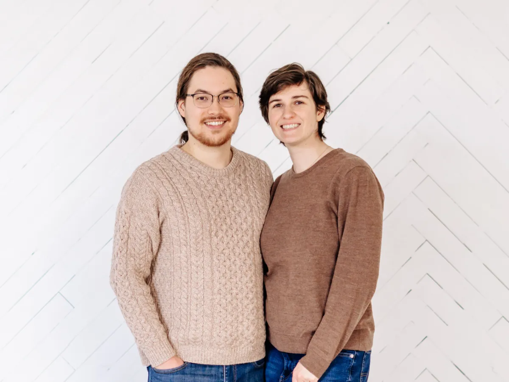

# About Adam Shin

Provo has been my home through many chapters of life. It's been a place for education, work, family, and friendship.

I was born in Arizona and grew up in West Jordan. My parents both attended BYU and taught me a love of learning from an early age. Education was always a priority in our home.

Like many others, I first came to Provo as a student. I studied computer science at BYU and went on to work as a software developer for multiple local companies. Being part of Provo's young single social scene was a highlight of my time here; I made many friends and great memories during those years.

My wife Cheyenne and I met here in Provo. When it came time to decide where to settle, Provo was the only place that made sense for us. We love our city's unique character, family-oriented culture, and access to the outdoors. And we're excited to be starting our own family here.

I love walking, hiking, and spending time in the outdoors. Some of my favorite places in Provo are the River Parkway, the Rock Canyon Trailhead, and Hruska's Kolaches.
