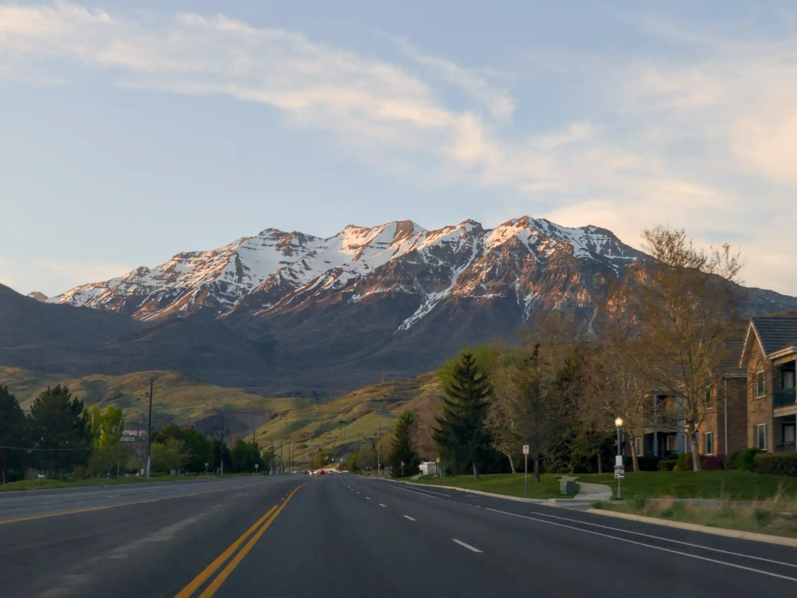

## Hi — I'm Adam.

Provo has shaped my life.

I've lived here as a student, a working professional, and now as a husband and father. I love our city and I'm proud to call it home.

Serving on Provo’s Planning Commission, I’ve been an advocate for housing affordability, safer streets, and responsible economic policy.

I'm excited to bring this experience to the City Council Citywide 1 seat.

## Forward-thinking leadership.

Provo faces both opportunities and challenges. It's time to make important choices about where we’re headed.

I’ll work to strengthen our economy, support families on the path to homeownership, improve active transportation and connectivity, and embrace careful growth while preserving our quality of life.

Provo needs clear vision and direction. I believe in our city’s future, and I’m committed to getting us there.

## Transparency and communication.

Clear communication helps us address problems early. It means fewer surprises down the road.

Provo residents should know exactly how decisions are made and where their money is spent, especially when it comes to essential services and infrastructure.

Better transparency makes for a stronger city. I promise to listen, keep you informed, and make sure your voice is heard.

## A city that works for everyone.

I love our city's ability to bring people together across generations. It's one of our greatest strengths.

Provo has a place for all of us: longtime residents, young families, students, and everyone in between. Let’s build a better future together.

I’d be honored to earn your vote this November!
