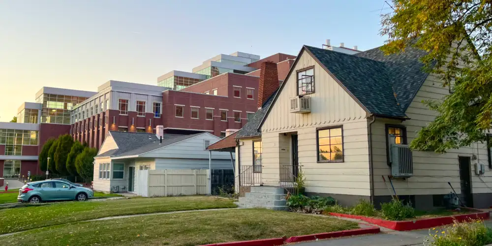
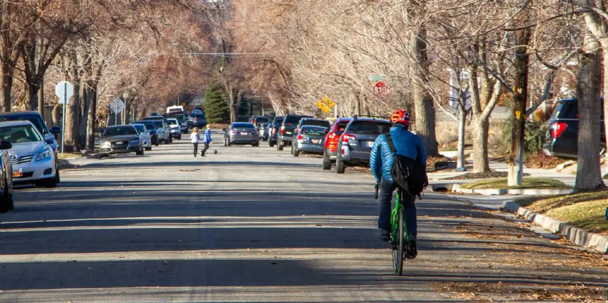
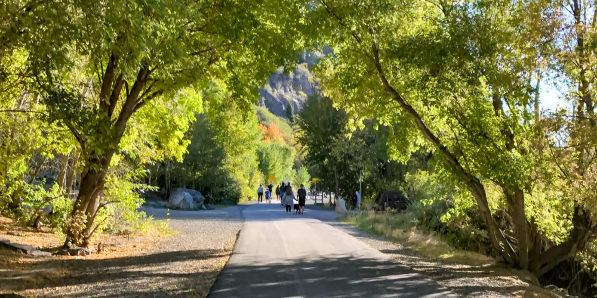

# Issues

- [Economy and Finance ›](#economy-and-finance)
- [Housing and Growth ›](#housing-and-growth)
- [Safe Streets ›](#safe-streets)
- [Parks, Trails, and the Outdoors ›](#parks-trails-and-the-outdoors)

## Economy and Finance

### Provo needs a strong economy and a sustainable budget.

To keep Provo thriving for years to come, we need to build a resilient economy and plan for the future.

**Right now, our budget is showing signs of stress.** Sales tax revenue — our city's main source of income — is falling by millions of dollars each year. At the same time, rising labor and material costs are driving up our expenses.

### Delayed maintenance is a form of hidden debt.

Roads, pipes, and facilities need maintenance. Much of our underground infrastructure is overdue for replacement. Some of our water lines are almost 100 years old.

**A recent report found we’re underfunding our water system by $10 million a year.** Instead of reinvesting in the system, we’ve spent that money elsewhere to cover for declining tax revenue.

Putting off maintenance saves money now, but it's not sustainable.

### It's time to get the fundamentals right.

In recent years, we've leaned on big, ambitious projects to attract economic growth: the Epic Sports Park, the airport, big box retail, and more. Some of these bets have paid off, but others may take years to prove their value.

**A strong economy isn't built on one or two big ideas, but lots of small ones.** Large speculative projects stretch our funds. But small businesses, infill projects, and mixed-use developments grow our tax base while making better use of the infrastructure we already have. 

When we invest in existing places, we get a better return on our money. This kind of incremental growth built Provo in the first place, and it can still help us today.

## Housing and Growth

### Provo should be a city where everyone can find a place to call home.

Housing is a key challenge for Provo. Families are being priced out of homeownership, while students and single renters fill up homes in family neighborhoods.

**The root cause of our housing problem is scarcity.** To solve it, we need more homes on the market, of all kinds — including rentals and student housing in locations where they're most needed.

A more abundant housing market helps everyone. When students and working professionals can live closer to where they study and work, it relieves pressure on our neighborhoods and makes it easier for families to buy back in.

### To promote homeownership, we need to address affordability.

Utah was recently ranked the third-least affordable state to buy a home, behind only Hawaii and California. Those states are outliers. We shouldn't be.

**The average sale price for a house in Provo is $700,000.** If we want to keep homeownership within reach for families, we need to lower the barriers to building more affordable homes.

This includes gentle, neighborhood-scale options like small-lot homes, backyard cottages, and townhouses. These offer an entry point into the market and fit well into existing communities.

### Growth is coming. We choose whether to guide it.

Provo is an economic hub. We offer education, jobs, recreation, and real opportunities for upward mobility.

**Utah County is projected to grow by over 160,000 people in the next decade.** If we push this growth outside our city, we could see thousands of new commuters driving into Provo each day — straining our resources without bringing in new revenue.

We should plan new growth around employment centers, the university, and transit. This will strengthen our tax base, reduce traffic, and provide a better quality of life for all our residents.

## Safe Streets

### Provo’s streets should be safe for everyone, especially kids.

**Our neighborhoods work best when everyone can get around safely — whether driving, cycling, or on foot.**

However, some of our busiest walking and biking areas are surrounded by wide roads with fast-moving traffic. These include school zones, downtown, and our university neighborhoods.

Too many of our streets put speed ahead of safety. But with smart planning and better priorities, we can change that.

### Safety starts with better design.

Street safety is a function of speed. When drivers slow down, crashes are less likely and less deadly.

Many streets in Provo’s older neighborhoods are 45 to 50 feet wide. That's as wide as four freeway lanes. When our streets look like highways, people drive like they're on one.

**We can improve street safety with simple tools.** Curb extensions, painted crosswalks, roundabouts, and narrower lanes are all proven ways to help calm traffic.

These solutions don't have to be expensive. We can try them out affordably using paint, bollards, and other low-cost materials. If they work, we can make them permanent.

## Parks, Trails, and the Outdoors

### Access to the outdoors is essential to Provo's quality of life.

Provo has incredible parks, trails, and natural spaces. We need to protect them and keep them accessible for future generations.

**Shared outdoor spaces make communities stronger.** Getting outside improves our health and our connections with neighbors. Parks and trails should be safe, convenient, and easy to use for all ages.

### The Provo River is a beloved resource. Let's make better use of it.

The Provo River Trail connects neighborhoods and brings people closer to nature. It’s one of our most valuable assets.

But in many areas, we've turned our back on the river. Much of its frontage is lined with fences, parking lots, and commercial sites.

**We should embrace the Provo River as a gathering place.**  As these areas redevelop, we have the chance to open up more of the river to the community. With better amenities and access, our riverfront could become an iconic destination for residents and visitors.
