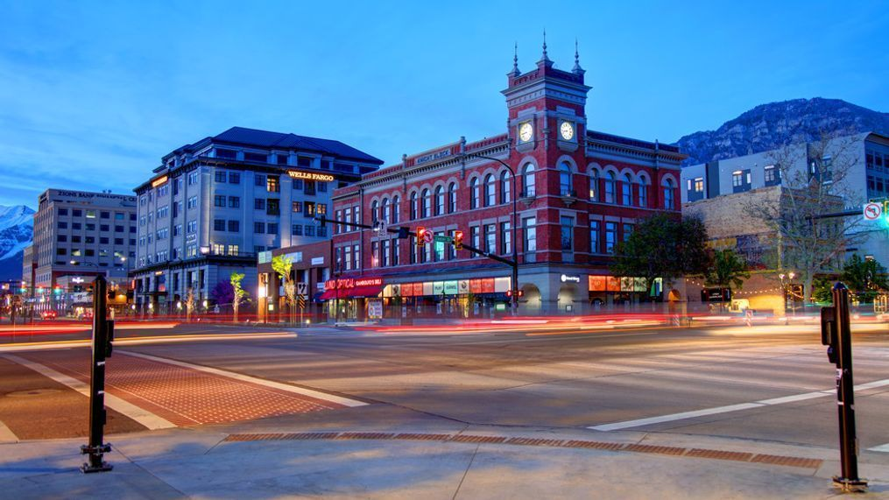
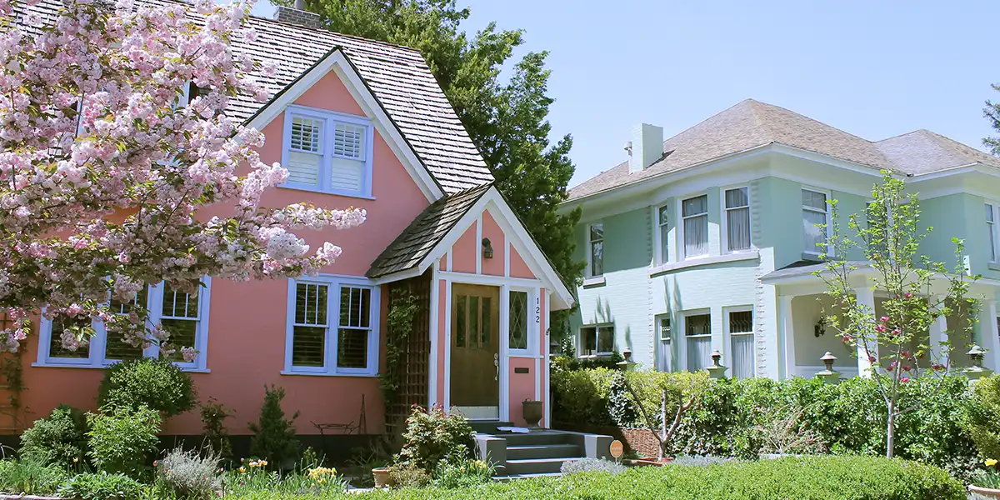

# Issues

- [Economy and Finance ›](#economy-and-finance)
- [Housing and Growth ›](#housing-and-growth)
- [Street Safety ›](#street-safety)
- [Parks, Trails, and the Outdoors ›](#parks-trails-and-the-outdoors)

## Economy and Finance

### Provo needs a strong economy and a sustainable budget.

To keep Provo thriving for years to come, we need to build a resilient economy and plan for the future.

**Right now, our budget is showing signs of stress.** Sales tax revenue — our city's main source of income — is falling by millions of dollars each year. At the same time, rising labor and material costs are driving up our expenses.

### Delayed maintenance is a form of hidden debt.

Roads, pipes, and facilities need maintenance. Much of our underground infrastructure is overdue for replacement. Some of our water lines are almost 100 years old.

**A recent report found we’re underfunding our water system by $10 million a year.** Instead of reinvesting in the system, we’ve spent that money elsewhere to cover for declining tax revenue.

Putting off maintenance saves money now, but it's not sustainable.

### We're relying on big bets to balance the budget.

In recent years, we've leaned on large, ambitious projects to attract economic growth — the Epic Sports Park, the airport, big box retailers, and more.

**Big projects cost money and come with risk.** Some of these bets have paid off, but others may take years to prove their value. If the return falls short, it'll be difficult to change course.

### It's time to get the fundamentals right.

Many of Provo's neighborhoods depend on subsidy. The property and sales tax they generate doesn't cover the long-term cost of the roads and pipes that service them.

We need to help these places become financially self-sustaining.

**A strong economy isn't built on a handful of big ideas, but hundreds of small ones.** Sprawling developments and speculative projects stretch our funds. But small businesses, infill projects, and mixed-use developments grow our tax base while making better use of the infrastructure we already have. 

When we invest in existing places, we get a better return on our money. This kind of incremental growth built Provo in the first place, and it can still help us today.

## Housing and Growth

### Provo should be a city where everyone can find a place to call home.

Housing is a key challenge for Provo. Families are being priced out of homeownership, while students and single renters fill up homes in family neighborhoods.

**The root cause of our housing problem is scarcity.** To solve it, we need more homes on the market, of all kinds — including rentals and student housing in locations where they're most needed.

A more abundant housing market helps everyone. When students and working professionals can live closer to where they study and work, it relieves pressure on our neighborhoods and makes it easier for families to buy back in.

### To promote homeownership, we need to address affordability.

Utah was recently ranked the third-least affordable state to buy a home, behind only Hawaii and California. Those states are outliers. We shouldn't be.

**The average sale price for a house in Provo is $700,000.** If we want to keep homeownership within reach for families, we need to lower the barriers to building more affordable homes.

This includes gentle, neighborhood-scale options like small-lot homes, backyard cottages, and townhouses. These offer an entry point into the market and fit well into existing communities.

### Growth is coming. We choose whether to guide it.

Provo is an economic hub. We offer education, jobs, recreation, and real opportunities for upward mobility.

Utah County is projected to grow by over 160,000 people in the next decade. If we push this growth outside our city, we could see thousands of new commuters coming to Provo each day for work and school.

**We should plan new growth around employment centers, the university, and transit.** This will strengthen our tax base, reduce traffic, and provide a better quality of life for all our residents.
